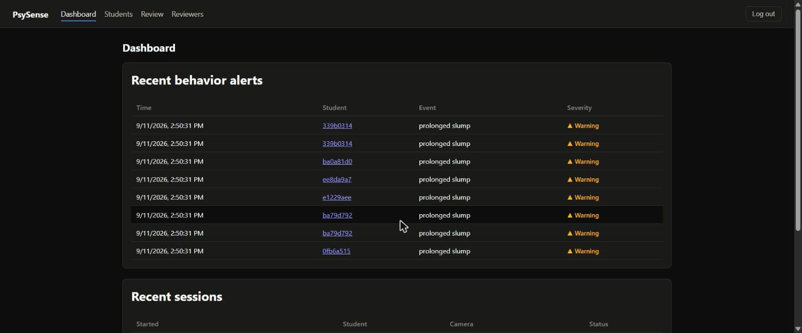
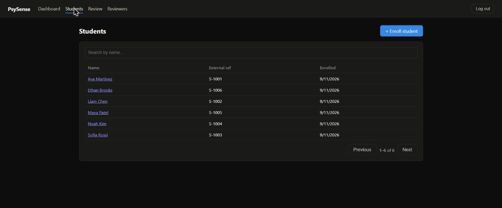
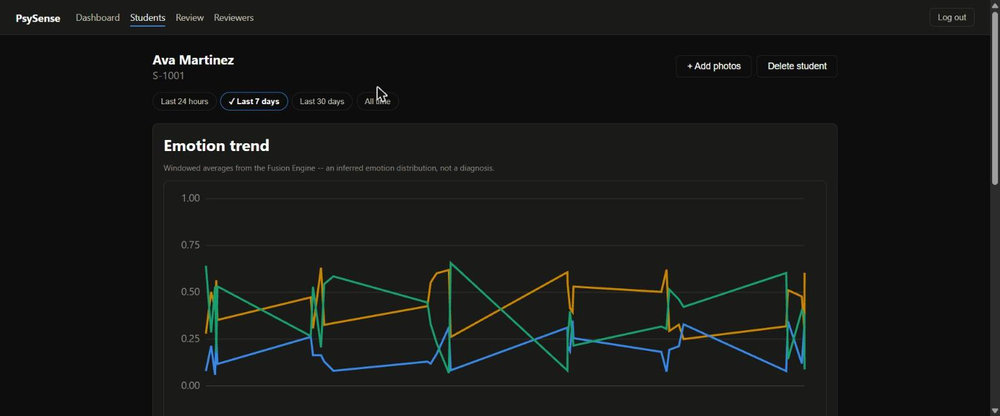
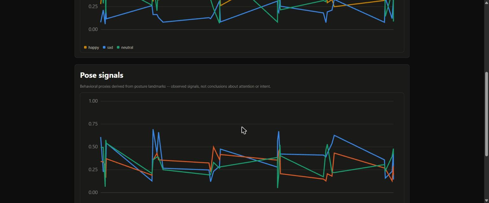
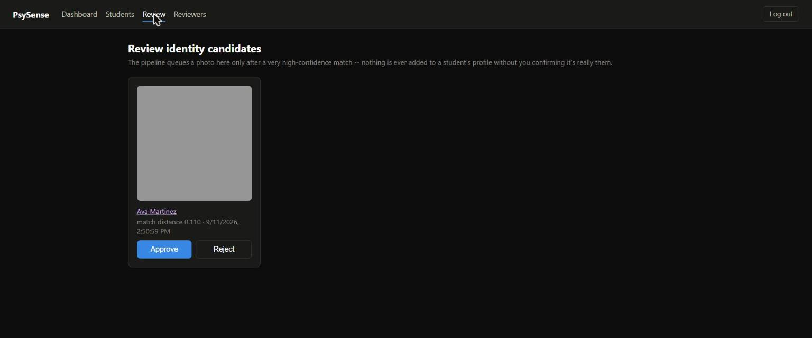
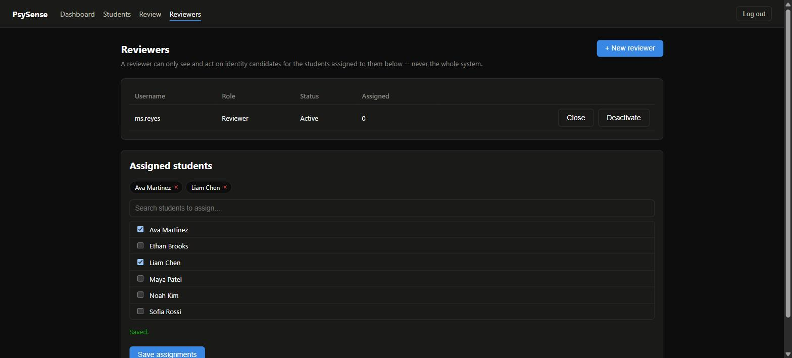
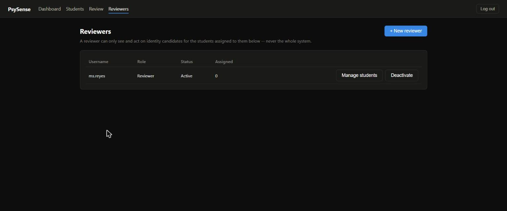
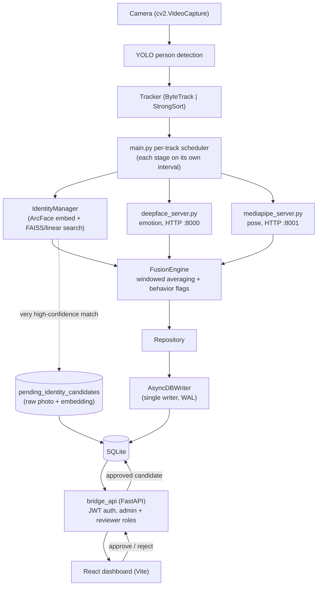

<div align="center">

# PsySense

**Real-time classroom/room behavioral analysis** — face-based identity, emotion, and
posture signals, fused over time and reviewed by a human before anything about a
person's profile changes.

[](#setup)
[](psysense/api)
[](frontend)
[](frontend/src)
[-07405E?logo=sqlite&logoColor=white)](psysense/db)
[](psysense/tests)
[](https://github.com/Z3ro-Kun/PsySense/commits/master)
[](#)

**[Live demo](#live-demo)** · **[Quick start](#quick-start)** · **[Screenshots](#screenshots)** · **[Architecture](#architecture)**

</div>

---

PsySense watches a camera feed, detects and tracks people, resolves who they are
from a face-embedding profile, samples emotion and posture signals, and fuses all
of that into windowed behavioral events — not raw video, not per-frame judgments.
A backend API and a React dashboard sit on top so a teacher/admin can actually see
and act on the data, enroll people, and review anything the identity system wants
to learn automatically before it's allowed to.

This README describes the system **as it actually exists in this repository** —
if anything here goes stale, the code is authoritative.

## Live demo

> Not deployed yet. Once you deploy your own copy (see [Deployment](#deployment)),
> put the link here — a demo account works well for a portfolio link since visitors
> can click straight into a populated dashboard instead of an empty one (see
> `psysense/scripts/seed_demo_data.py`).

## Contents

- [Live demo](#live-demo)
- [Quick start](#quick-start)
- [Screenshots](#screenshots)
- [Highlights](#highlights)
- [Architecture](#architecture)
- [Repository layout](#repository-layout)
- [Setup](#setup)
- [Running it](#running-it)
- [Testing](#testing)
- [Deployment](#deployment)
- [Privacy & security posture](#privacy--security-posture)
- [Known limitations / roadmap](#known-limitations--roadmap)
- [Troubleshooting](#troubleshooting)

## Quick start

Want to just see the dashboard working, no camera or ML models required? This
spins up the backend and frontend against a database seeded with realistic fake
students and history:

```powershell
# 1. Backend deps
cd psysense
python -m venv main_env; main_env\Scripts\activate
pip install -r ..\requirements.txt

# 2. Create your .env and an admin login (there is no .env yet -- only .env.example)
copy ..\.env.example ..\.env
python -m scripts.create_admin
```

`create_admin` prompts for a username and password, then prints three lines
(`ADMIN_USERNAME`, `ADMIN_PASSWORD_HASH`, `JWT_SECRET`) — paste those into the
`..\.env` file you just created, replacing the empty placeholders. This account
is what you'll actually log into the dashboard with in step 5 below.

```powershell
# 3. Seed demo data (fake students, no real photos, no real ML model needed)
python -m scripts.seed_demo_data

# 4. Run the API
python -m uvicorn api.asgi:app --reload

# 5. In a second terminal: the dashboard
cd ..\frontend
npm install
npm run dev
```

Open `http://localhost:5173`, sign in with the admin username/password you set in
step 2, and the dashboard is already populated. Running the *real* camera
pipeline (identity/emotion/pose inference) is a separate, heavier setup — see
[Setup](#setup).

## Screenshots

<table>
<tr>
<td width="50%">

**Dashboard** — recent behavior alerts and sessions at a glance

</td>
<td width="50%">

**Students** — search and manage enrolled profiles

</td>
</tr>
<tr>
<td width="50%">

**Emotion trend** — windowed, per-student, never a single-frame judgment

</td>
<td width="50%">

**Pose signals** — posture proxies over the same time window

</td>
</tr>
<tr>
<td width="50%">

**Review queue** — a human confirms every auto-suggested profile update

</td>
<td width="50%">

**Scoped reviewers** — sub-admins see only the students assigned to them

</td>
</tr>
</table>

<details>
<summary>More screenshots (login, reviewer accounts list)</summary>
<br>




</details>

## Highlights

- **Decoupled identity** — a tracker ID is a short-lived, frame-to-frame hint;
  `student_id` (resolved by ArcFace embedding search, FAISS or linear-scan
  fallback) is the only identity that ever gets written to the database. Losing
  and regaining track of someone doesn't create a new person.
- **Independent-frequency pipeline** — detection/tracking run every frame;
  identity resolution, emotion sampling, and pose sampling each run on their own
  configurable interval per tracked person, not in lockstep.
- **Graceful degradation everywhere** — if the emotion or pose service is down,
  the pipeline keeps running with that signal marked unavailable rather than
  crashing or fabricating a value.
- **Human-in-the-loop profile enrichment** — a face is only ever added to
  someone's identity profile in two ways: (1) an admin explicitly enrolling
  photos, or (2) the pipeline getting an *extremely* confident match, queuing it,
  and a human approving or rejecting the actual photo in the dashboard's Review
  page. Nothing updates a profile silently, and a rejected candidate leaves no
  trace — image and embedding both discarded.
- **Scoped reviewer accounts** — beyond the root admin, sub-admin "reviewer"
  accounts can be created and assigned to specific students; a reviewer can only
  see and act on candidates for the people they're assigned to, enforced
  server-side, not just hidden in the UI.
- **Typed, tested backend** — Pydantic config/domain models throughout, a single
  async DB writer serializing all SQLite writes (WAL mode, so readers never
  block), and 65 backend tests that run without a GPU, camera, or real ML models
  (fakes stand in for InsightFace/DeepFace/MediaPipe).

## Architecture



See `psysense/services/identity/manager.py`'s docstring and
`psysense/tests/test_identity_manager.py::test_identity_decoupled_from_tracker_id`
for how tracker-ID decoupling is actually enforced and tested.

## Repository layout

```
psysense/
  main.py                    camera pipeline entrypoint
  deepface_server.py         emotion analysis HTTP service (port 8000)
  mediapipe_server.py        pose analysis HTTP service (port 8001)
  pose_analyzer.py           landmark -> pose-cue math, used by mediapipe_server
  utils.py                   image crop/encode helpers
  core/                      config loading, domain models, interfaces, exceptions
  db/                        schema, AsyncDBWriter (single writer, WAL), Repository
  services/
    identity/                 ArcFace embedder, quality gate, vector index, IdentityManager
    fusion/                   windowed averaging + behavior-flag engine
    tracking/                 ByteTrack/StrongSort wrapper
  api/                        bridge_api: FastAPI app, auth (JWT + roles), routers, schemas
    routers/                   auth, students, telemetry, identity-candidates, users
  scripts/
    create_admin.py            generates ADMIN_PASSWORD_HASH/JWT_SECRET for .env
    seed_demo_data.py           populates fake students + history for demos/screenshots
  tests/                      pytest suite -- pipeline + full API, no real models required
  benchmarks/                 tracker A/B benchmark script
  config/config.yaml          all non-secret tunables
frontend/                    React + Vite + TypeScript dashboard
  src/api/                     fetch client, typed endpoint wrappers, mirrored types
  src/auth/                    JWT + role session context, route guards
  src/components/               shared UI (charts, dropzone, layout, badges)
  src/pages/                    one file per route
docs/screenshots/            images used in this README
docker-compose.yml           bridge_api container definition
requirements*.txt            per-service Python dependencies (see Setup)
```

## Setup

<details>
<summary><strong>Python environments</strong></summary>
<br>

Three separate venvs, historically kept apart because their dependency chains
conflict with each other:

| venv | installs from | runs |
|---|---|---|
| `main_env` | `requirements.txt` | `main.py` (camera pipeline) and `bridge_api` |
| `deepface_env` | `requirements-deepface.txt` | `deepface_server.py` |
| `mediapipe_env` | `requirements-mediapipe.txt` | `mediapipe_server.py` |

```powershell
python -m venv main_env
main_env\Scripts\activate
pip install -r requirements.txt
```

(repeat per venv with its own requirements file, from the repo root)

Python 3.10+ — InsightFace/FAISS wheel availability is the main constraint on
very new Python versions.

</details>

<details>
<summary><strong>Model files</strong> (not committed — see <code>.gitignore</code>)</summary>
<br>

- `yolov8n.pt` — YOLO person detector
- `osnet_x0_25_msmt17.pt` / `.onnx` — StrongSort ReID weights (only needed if
  `pipeline.tracker.kind: "strongsort"` in config.yaml; ByteTrack is the default
  and needs neither)
- `pose_landmarker_heavy.task` — MediaPipe pose model

InsightFace's `buffalo_l` model pack downloads itself on first use of the
identity subsystem — no manual step, but it needs network access the first time.

</details>

<details>
<summary><strong>Configuration</strong></summary>
<br>

- `psysense/config/config.yaml` — every non-secret tunable: ports, camera
  source, quality/matching thresholds, human-review auto-update thresholds,
  intervals, database path, CORS origin, log level. Never put secrets here.
- `.env` (gitignored; copy `.env.example`) — only `ADMIN_USERNAME`,
  `ADMIN_PASSWORD_HASH`, `JWT_SECRET`, generated with:

  ```powershell
  cd psysense
  python -m scripts.create_admin
  ```

  This is the root admin — a break-glass account that always works. Additional
  "reviewer" accounts (scoped to specific students) are created afterward from
  the dashboard's Manage Reviewers page, not via environment variables.

</details>

<details>
<summary><strong>Frontend</strong></summary>
<br>

```powershell
cd frontend
npm install
```

</details>

## Running it

Five separate processes, five separate terminals, each starting from the repo
root — the venv must be **activated in that terminal** before its command will
work (a bare `python psysense\...` in a terminal with the wrong/no venv active
fails with `ModuleNotFoundError`, not a helpful error):

```powershell
# Terminal 1 -- emotion service
deepface_env\Scripts\activate
python psysense\deepface_server.py

# Terminal 2 -- pose service
mediapipe_env\Scripts\activate
python psysense\mediapipe_server.py

# Terminal 3 -- camera pipeline
main_env\Scripts\activate
cd psysense
python main.py

# Terminal 4 -- backend API (.env loads automatically -- see api/asgi.py)
main_env\Scripts\activate
cd psysense
python -m uvicorn api.asgi:app --host 0.0.0.0 --port 8080

# Terminal 5 -- frontend dev server (no venv -- this one's Node, not Python)
cd frontend
npm run dev
```

`main.py` does not open a display window by default
(`pipeline.display.headless` in config.yaml) — set it to `false` for a debug
overlay (bounding boxes, resolved identity, live emotion/pose readout) during
development.

The frontend is pinned to port `5173` (`--strictPort`, matching
`config.yaml`'s `api.frontend_url`) — if that port is taken, `npm run dev`
fails loudly instead of silently landing on a different port and breaking CORS.

## Testing

```powershell
cd psysense
python -m pytest -q
```

All 65 tests run without real ML models, a camera, or GPU — the identity/API
tests use fakes (`tests/test_identity_manager.py`'s `FakeEmbedder`,
`FakeQualityAssessor`) against a real temp-file SQLite database, so they still
exercise real persistence, concurrency, and role-authorization logic, just not
real inference.

```powershell
cd frontend
npm run build     # tsc -b && vite build -- this is also the type-check
```

## Deployment

**bridge_api runs on the same machine as the camera pipeline**, reading the same
SQLite file `main.py` writes. This was a deliberate choice over a separate cloud
server with a sync process — it avoids inventing a second database and a sync
engine for a single-deployment setup.

For a **portfolio demo** specifically (no camera, no real ML models, $0 hosting),
see the collapsible guide below — it deploys the dashboard + API seeded with
`seed_demo_data.py`'s fake students, which is the honest way to show this off
publicly: the camera pipeline needs local hardware and can't run in the cloud
for free, so a public deployment is inherently the dashboard/API layer, not a
live feed.

<details>
<summary><strong>Free portfolio deployment (frontend on Vercel, backend on Render)</strong></summary>
<br>

1. **Backend → [Render](https://render.com)** (free web service tier — $0, no
   card required; cold-starts after ~15 min idle, which is normal for a demo):
   - New → Web Service → connect this GitHub repo.
   - Root directory: `psysense`. Dockerfile path: `Dockerfile.api`.
   - Add environment variables: `ADMIN_USERNAME`, `ADMIN_PASSWORD_HASH`,
     `JWT_SECRET` (from `python -m scripts.create_admin`, run locally first).
   - Free tier disk is ephemeral (wiped on redeploy) — that's fine for a demo;
     add a start-up seed step (Render's "Start Command" or a
     `postdeploy`/entrypoint hook) that runs
     `python -m scripts.seed_demo_data` before `uvicorn`, so a fresh deploy is
     never empty.
   - Note the resulting URL, e.g. `https://psysense-api.onrender.com`.

2. **Frontend → [Vercel](https://vercel.com)** (free hobby tier — $0):
   - Import this repo, set the project root to `frontend`.
   - Environment variable: `VITE_API_URL` = your Render URL from step 1.
   - Before deploying, edit `psysense/config/config.yaml`'s `api.frontend_url`
     to your Vercel URL (e.g. `https://psysense.vercel.app`) and push — CORS is
     locked to exactly that origin, so the backend needs to know it in advance.

3. Visit your Vercel URL, log in with the admin account from step 1. The
   dashboard is now permanently live at $0/month, seeded with demo data.

**If you want to show the real pipeline working** (not just the dashboard) for
a live interview/demo instead of a permanent link: run `main.py` +
`deepface_server.py` + `mediapipe_server.py` locally with your own camera, and
temporarily expose local `bridge_api` with a free tunnel
([Cloudflare Tunnel](https://developers.cloudflare.com/cloudflare-one/connections/connect-networks/)
or [ngrok](https://ngrok.com)) pointed at your deployed frontend's CORS origin.
This can't be a permanent free deployment — it fundamentally needs a camera.

</details>

<details>
<summary><strong>Backend via Docker (self-hosted)</strong></summary>
<br>

```powershell
docker compose build bridge_api
docker compose up -d bridge_api
```

See `docker-compose.yml` and `psysense/Dockerfile.api`. Requires `.env` at the
repo root. The pipeline and inference servers are **not** containerized (camera
device access and the three conflicting venvs don't map cleanly onto compose
services) — run those directly on the host.

</details>

<details>
<summary><strong>Frontend, any static host</strong></summary>
<br>

```powershell
cd frontend
npm run build
```

Deploy the `dist/` output to Vercel/Netlify/GitHub Pages (all auto-detect or
easily configure a Vite build) or any static host. Set `VITE_API_URL` to
wherever bridge_api is reachable, and `config.yaml`'s `api.frontend_url` to the
deployed frontend's exact origin — CORS is locked to that one origin, never `*`.

</details>

## Privacy & security posture

- Raw face images are **never** stored except transiently, for the human-review
  step of the auto-update queue — and even then only until an admin/reviewer
  approves (image discarded, embedding kept) or rejects (both discarded), or
  `identity.auto_update.pending_retention_days` (default 7) expires, whichever
  comes first.
- Enrollment photos themselves are never persisted either — only the extracted
  embedding vector.
- Every write to the database goes through one serialized async writer; no
  ad-hoc SQL exists outside `db/repository/repository.py`.
- JWTs carry a role claim (`admin` | `reviewer`); reviewer-scoped routes check
  the caller's actual assignment server-side on every request, not just at
  login.
- CORS is locked to a single configured origin. Never wildcarded.
- Passwords are hashed with `bcrypt` directly (no unmaintained compatibility
  shims); login attempts are rate-limited per username with a lockout window.

## Known limitations / roadmap

- **Single-tenant.** Sub-admin "reviewer" roles exist and are scoped per-student,
  but there is no organization/tenant concept yet — one shared student roster,
  no cross-org data isolation, no billing, no email invites. This is a
  deliberately deferred, separate design effort for a multi-business deployment.
- **Identity robustness depends on enrollment breadth.** A single-photo
  enrollment will not generalize across meaningfully different conditions
  (glasses on/off, very different lighting/angle) — enroll with several photos
  spanning real variation, or add more later from a student's detail page.
- **Emotion classification reflects DeepFace's underlying model**, which is
  known to bias toward "sad" for a neutral/resting expression (a FER-2013
  training-data artifact, not a PsySense bug) — treat emotion output as an
  inferred signal, not a diagnosis.
- **No CI pipeline configured** in this repository yet — tests are run locally.

## Troubleshooting

<details>
<summary>Expand common issues</summary>
<br>

- **"config.yaml not found"** — `core/config.py` fails loudly by design; create
  `psysense/config/config.yaml` (copy the one in this repo) rather than relying
  on hardcoded defaults.
- **bridge_api won't start** — check `ADMIN_USERNAME`/`ADMIN_PASSWORD_HASH`/
  `JWT_SECRET` are present in `.env` (loaded automatically by `api/asgi.py`);
  it refuses to start without them.
- **Emotion/pose showing as unavailable** — the pipeline degrades gracefully if
  `deepface_server`/`mediapipe_server` are down; check their own process logs,
  not `main.py`'s.
- **A newly enrolled student isn't recognized yet** — the running pipeline picks
  up new enrollments on a periodic refresh
  (`pipeline.frequencies.identity_refresh_interval_sec`, default 30s), not
  instantly.
- **Slow/erratic emotion inference, or a `haarcascade` error from DeepFace** —
  `deepface_server.py` uses `detector_backend="skip"` (the frame is already a
  person-crop from YOLO, so a second face detector is redundant); if you've
  modified that, an incomplete OpenCV install can surface as a missing
  haarcascade XML file.
- **Nothing shows up in the Review page** — that's the expected empty state, not
  an error; candidates only appear after the pipeline gets a match well above
  the normal match threshold (`identity.auto_update.distance_threshold`).
- **Diagnosing a resolve() match failure** — set `logging.level: "DEBUG"` in
  `config.yaml` temporarily; `main.py` will then log the exact quality-gate
  reason or match distance for every resolution attempt instead of a bare
  "unknown".

</details>
